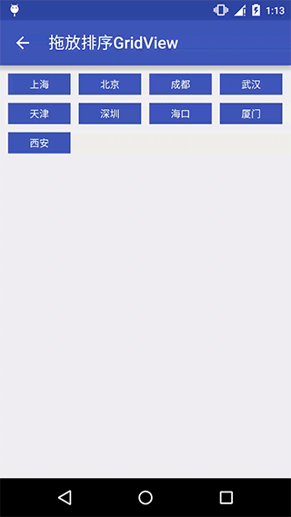
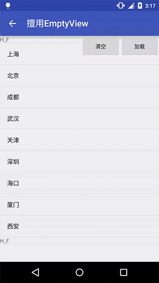
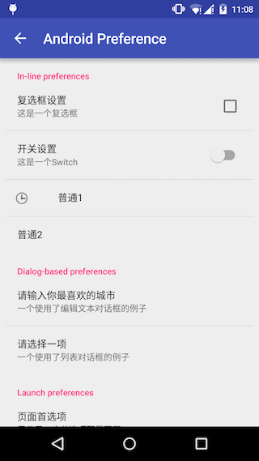

## Android Example Code
一些Android验证代码

### 在Service中显示Dialog

### DropDownMenu —— 下拉形式的菜单

### GridViewSort —— 可排序的GridView，类似网易新闻客户端的分类排序

### EmptyView ——  充分利用ListView的setEmptyView(View)

### Android Preference

### 耳机回环（对准麦克风说话，耳机传出响应内容） —— Android 5.0以上的机器目前存在问题

### WebSocket —— 注意修改对应的服务器地址以及端口